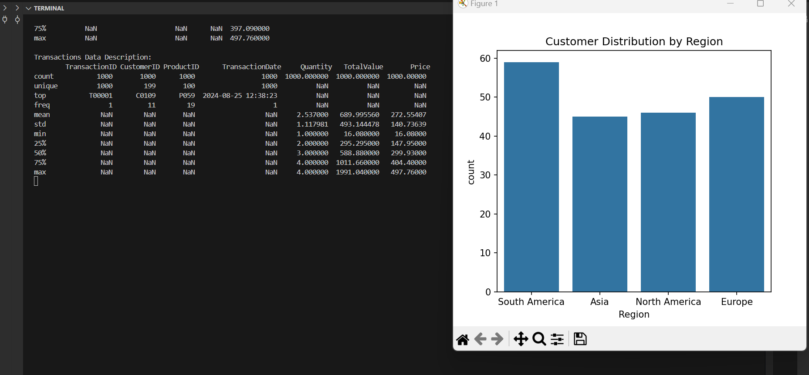
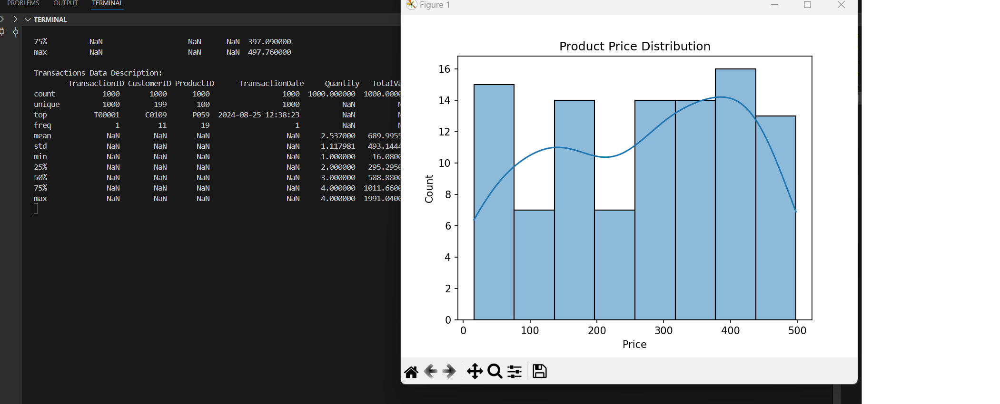
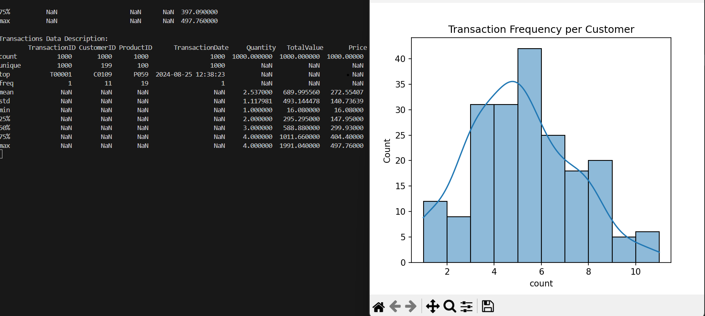
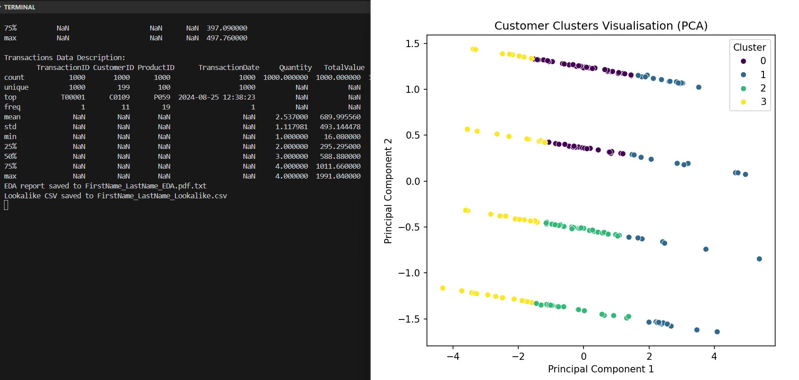

# eCommerce Data Science Project: Transactions Dataset Analysis

## Overview

This project is a data science assignment focused on analyzing an eCommerce transactions dataset. It involves Exploratory Data Analysis (EDA), building a Lookalike Model, and performing Customer Segmentation. The project utilizes Python with libraries like pandas, scikit-learn, matplotlib, and seaborn to extract insights and build predictive models from three provided CSV files: `Customers.csv`, `Products.csv`, and `Transactions.csv`.

This `readme.md` provides instructions on setting up and running the project code, along with an overview of the project structure and deliverables.

## Table of Contents

1.  [File Structure](#file-structure)
2.  [Dependencies](#dependencies)
3.  [Setup Instructions](#setup-instructions)
4.  [Running the Code](#running-the-code)
    *   [Running the Main Script](#running-the-main-script)
    *   [Running the Test Script](#running-the-test-script)
5.  [Project Tasks](#project-tasks)
    *   [Task 1: Exploratory Data Analysis (EDA) and Business Insights](#task-1-exploratory-data-analysis-eda-and-business-insights)
    *   [Task 2: Lookalike Model](#task-2-lookalike-model)
    *   [Task 3: Customer Segmentation / Clustering](#task-3-customer-segmentation--clustering)
6.  [Deliverables](#deliverables)
7.  [File Naming Convention](#file-naming-convention)
8.  [GitHub Repository](#github-repository)
9.  [Author](#author)
10. [License](#license)

## File Structure

```
eCommerce_Project/
├── Customers.csv          # Customer data
├── Products.csv           # Product data
├── Transactions.csv       # Transaction data
├── ecommerce.py  # Main Python script containing project code (e.g., ecommerce_analytics.py)
├── test_ecommerce.py     # Python test script for project code
├── Customers_test.csv     # (Test files - created and deleted during testing)
├── Products_test.csv      # (Test files - created and deleted during testing)
├── Transactions_test.csv  # (Test files - created and deleted during testing)
├── FirstName_LastName_EDA.pdf.txt      # (Example EDA report - text file, could be PDF)
├── FirstName_LastName_EDA.ipynb        # (Jupyter Notebook for EDA - if used)
├── FirstName_LastName_Lookalike.csv    # Lookalike model output CSV
├── FirstName_LastName_Lookalike.ipynb  # (Jupyter Notebook for Lookalike Model - if used)
├── FirstName_LastName_Clustering.pdf.txt # (Example Clustering report - text file, could be PDF)
├── FirstName_LastName_Clustering.ipynb   # (Jupyter Notebook for Clustering - if used)
└── README.md              # This README file
```

**Note:**

*   Replace `ecommerce.py` with the actual name of your main Python code file.
*   The `.pdf.txt` report files are used as simplified text-based reports as mentioned in the code comments. You can modify the code to generate actual PDF reports using libraries like `reportlab` or `fpdf` if desired.
*   Jupyter notebooks (`.ipynb`) are optional deliverables and are included if you choose to use them for EDA and model development.

## Dependencies

Before running the project, ensure you have the following Python libraries installed. You can install them using `pip`:

```bash
pip install pandas scikit-learn matplotlib seaborn
```

*   **pandas:** For data manipulation and analysis.
*   **scikit-learn (sklearn):** For machine learning tasks (clustering, similarity calculations, preprocessing, metrics).
*   **matplotlib:** For data visualization.
*   **seaborn:** For enhanced data visualizations.
*   **typing:** For type hinting (optional, but good for code clarity).

## Setup Instructions

1.  **Clone the repository (if applicable):**
    If you have the project code in a Git repository, clone it to your local machine:

    ```bash
    git clone https://github.com/ramyavarma123/EcommerceAnalytics.git
    cd eCommerce_Project
    ```

2.  **Install Dependencies:**
    Navigate to the project directory in your terminal and install the required Python libraries using pip:

    ```bash
    pip install -r requirements.txt  # If you have a requirements.txt file

    # OR install them individually if you don't have requirements.txt
    pip install pandas scikit-learn matplotlib seaborn
    ```

    *(Optional: Create a `requirements.txt` file listing the dependencies for easier installation in the future using `pip freeze > requirements.txt` after installing the libraries)*

3.  **Download Data Files:**
    Download the provided CSV files (`Customers.csv`, `Products.csv`, `Transactions.csv`) from the Google Drive links in the assignment description and place them in the same directory as your Python scripts, or update the file paths in your code accordingly.

## Running the Code

### Running the Main Script

To execute the main data analysis script (e.g., `your_main_code_file.py`), navigate to the project directory in your terminal and run:

```bash
python eCommerce_Project/ecommerce.py
```

This will:

*   Perform EDA and generate a business insights report (`FirstName_LastName_EDA.pdf.txt`).
*   Build a Lookalike Model and generate the `FirstName_LastName_Lookalike.csv` file.
*   Perform Customer Segmentation/Clustering and generate a clustering report (`FirstName_LastName_Clustering.pdf.txt`).
*   Display visualizations as part of the EDA and Clustering tasks (using `matplotlib`).

### Running the Test Script

To run the unit tests and verify the functionality of your code, execute the test script (`test_ecommerce.py`) from your terminal in the project directory:

```bash
python eCommerce_Project/test_ecommerce.py
```

This will run the test suite and report on the test results. Ensure all tests pass to confirm the correctness of your code.

## Project Tasks

### Task 1: Exploratory Data Analysis (EDA) and Business Insights

*   Perform EDA on the `Customers.csv`, `Products.csv`, and `Transactions.csv` datasets.
*   Derive at least 5 business insights from the EDA.
*   Deliverables:
    *   Python script/Jupyter Notebook (`FirstName_LastName_EDA.ipynb` or similar).
    *   PDF report with business insights (`FirstName_LastName_EDA.pdf.txt` or `FirstName_LastName_EDA.pdf`).

### Task 2: Lookalike Model

*   Build a Lookalike Model to recommend 3 similar customers for a given user.
*   Use customer and product information.
*   Assign similarity scores.
*   Deliverables:
    *   Lookalike CSV file (`FirstName_LastName_Lookalike.csv`) with top 3 lookalikes and scores for the first 20 customers.
    *   Python script/Jupyter Notebook (`FirstName_LastName_Lookalike.ipynb` or similar) explaining the model.

### Task 3: Customer Segmentation / Clustering

*   Perform customer segmentation using clustering techniques.
*   Use profile and transaction information.
*   Choose a clustering algorithm (e.g., KMeans) and number of clusters (2-10).
*   Calculate clustering metrics (DB Index).
*   Visualize clusters.
*   Deliverables:
    *   Clustering report (`FirstName_LastName_Clustering.pdf.txt` or `FirstName_LastName_Clustering.pdf`) with number of clusters, DB Index, other metrics, and interpretation.
    *   Python script/Jupyter Notebook (`FirstName_LastName_Clustering.ipynb` or similar) containing clustering code.

## Deliverables

For submission, ensure you include the following files in your GitHub repository:

*   **Task 1:**
    *   `FirstName_LastName_EDA.pdf.txt` (`.pdf` if you generated a proper PDF)
    *   `FirstName_LastName_EDA.ipynb` (or `.py`)
*   **Task 2:**
    *   `FirstName_LastName_Lookalike.csv`
    *   `FirstName_LastName_Lookalike.ipynb` (or `.py`)
*   **Task 3:**
    *   `FirstName_LastName_Clustering.pdf.txt` (`.pdf` if you generated a proper PDF)
    *   `FirstName_LastName_Clustering.ipynb` (or `.py`)
*   `README.md`
*   `Customers.csv`, `Products.csv`, `Transactions.csv` (Optional, but recommended for reproducibility if data is not too large and shareable).
*   `requirements.txt` (Optional, but good practice).
*   `test_ecommerce.py` (Optional, but showcasing testing is good practice).

## File Naming Convention

Please adhere to the following file naming convention for all your submitted files:

*   `FirstName_LastName_EDA.pdf`
*   `FirstName_LastName_EDA.ipynb`
*   `FirstName_LastName_Lookalike.csv`
*   `FirstName_LastName_Lookalike.ipynb`
*   `FirstName_LastName_Clustering.pdf`
*   `FirstName_LastName_Clustering.ipynb`

Replace `FirstName` and `LastName` with your actual first and last name.

# Results




## GitHub Repository

Upload all your code files, reports, and the README.md to a **public** GitHub repository. Provide the GitHub repository link for submission.

## Author

[Ramya Kandimalla](https://github.com/ramyavarma123)


## License

[Optional: Choose a license if you wish to apply one, e.g., MIT License, Apache 2.0 License. If not, you can omit this section or state "No License"]

---

This README provides a comprehensive guide to the eCommerce Data Science project. Ensure you follow all instructions and naming conventions for successful submission. Good luck!
```


